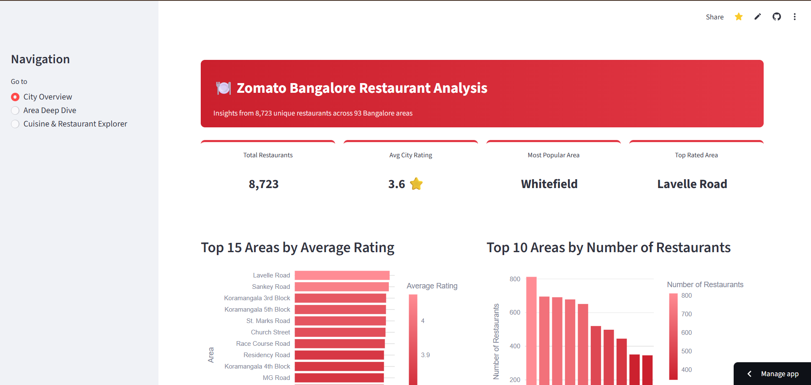
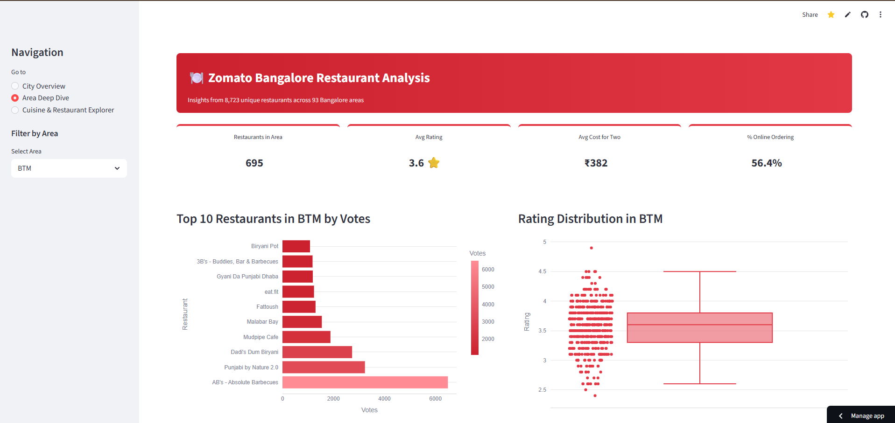
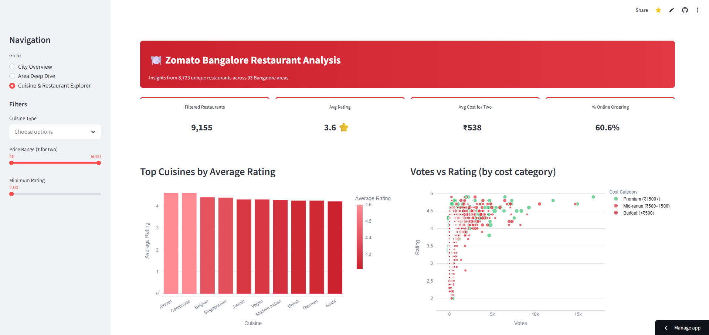

# 🍽️ Zomato Bangalore Restaurant Performance Analysis

[](https://python.org)
[](https://postgresql.org)
[](https://zomato-bangalore-analysis.streamlit.app)
[](https://plotly.com)
[](https://pandas.pydata.org)

[](https://zomato-bangalore-analysis.streamlit.app)

End-to-end data analytics project on 8,723 unique Bangalore restaurants — covering data cleaning, PostgreSQL, EDA, and an interactive Streamlit dashboard.

---

## 📖 The Story Behind This Project

Before writing a single line of Python, I spent a year as a Zomato delivery partner in Mysore — completing **2,500+ orders** on a 4-hour daily shift. I knew peak hours not from a dashboard but from traffic and cold food bags. I understood restaurant ratings not as numbers but as the difference between a smooth handoff and a 20-minute wait.

When I found this dataset on Kaggle, I recognised patterns I had already lived. This project is my attempt to quantify them: which areas produce inconsistent restaurants, whether price actually buys quality, and why some restaurants stay invisible despite good food.

---

## 🗂️ Table of Contents

- [Tech Stack](#-tech-stack)
- [Dataset & Cleaning](#-dataset--cleaning)
- [Business Questions](#️-business-questions)
- [Key Findings](#-key-findings)
- [SQL Analysis](#-sql-analysis)
- [Screenshots](#-screenshots)
- [Project Structure](#-project-structure)
- [How to Run Locally](#-how-to-run-locally)
- [About Me](#-about-me)

---

## 🛠️ Tech Stack

| Layer | Tools |
|---|---|
| Data Processing | Python, pandas, NumPy |
| Visualization | seaborn, matplotlib, Plotly |
| Database | PostgreSQL, SQLAlchemy |
| Dashboard | Streamlit |

---

## 📦 Dataset & Cleaning

**Source:** [Zomato Bangalore Dataset by Himanshu Poddar — Kaggle](https://www.kaggle.com/datasets/himanshupoddar/zomato-bangalore-restaurants)

| Stage | Rows |
|---|---|
| Raw (`zomato.csv`) | ~51,000 |
| After cleaning & dedup | **8,723 unique restaurants** |

**What was cleaned (`02_data_cleaning.ipynb`):**

- **Dropped unused columns:** `url`, `address`, `phone`, `dish_liked`, `reviews_list`, `menu_item`
- **`rate` column:** Contained `"NEW"`, `"-"`, and `"/5"` strings — stripped and cast to `float`, unparseable values set to `NaN`
- **`approx_cost(for two people)`:** Comma-formatted strings stripped and cast to `int`, renamed to `cost_for_two`
- **`online_order` / `book_table`:** Mapped `Yes/No` → `1/0`
- **Nulls:** Rows with nulls in `location`, `rest_type`, `cuisines`, `cost_for_two` dropped
- **Deduplication:** Same restaurant listed multiple times under different `listed_in(type)` values (Delivery, Dine-out, Buffet, etc.). Deduplicated on `name + location`, keeping the row with the highest `votes`. Result: 8,723 unique restaurants across 93 areas.

---

## 🏙️ Business Questions

| # | Question |
|---|---|
| 1 | Which cuisines have the highest rating but lowest order volume — hidden gems? |
| 2 | Which Bangalore areas have the most low-rated restaurants? |
| 3 | Is there a correlation between price range and customer rating? |
| 4 | Which restaurant types get the most votes — does that match their rating? |
| 5 | What does rating distribution look like across the city? |

---

## 📊 Key Findings

**City-wide rating:** Mean **3.63**, median **3.70** — slight left skew from a minority of poor restaurants pulling the average down.

**Low-rated area hotspots (rate < 3.5):**
- Whitefield — 211 low-rated restaurants
- Electronic City — 200
- Marathahalli — 195

All three are IT corridor areas with high order volume and inconsistent quality.

**Price vs rating (boxplot analysis):**
- Budget (≤₹300): wide distribution, median ~3.5
- Luxury (₹1,000+): narrow, high distribution, median ~4.1
- Higher price genuinely correlates with more *consistent* quality

**Restaurant type vs votes:**
- Casual Dining + Café combinations attract the highest average votes (1,500+)
- Fine Dining has the highest average rating (~4.1) but far fewer votes — quality without visibility

**Correlation heatmap findings:**
- `book_table` × `cost_for_two`: **0.61** — expensive restaurants are strongly more likely to offer table booking
- `online_order` × `cost_for_two`: **-0.14** — premium restaurants lean away from online orders

**Top-rated area:** Lavelle Road (avg 4.1) | **Most restaurants:** Jayanagar

---

## 🗄️ SQL Analysis

Data loaded into PostgreSQL via SQLAlchemy (`03_load_to_postgresql.ipynb`). Six queries across two files using CTEs and window functions:

**`01_basic_analysis.sql`**

| Query | What it does |
|---|---|
| Area rating summary | `AVG`, `MAX`, `MIN` rating per area (min 20 restaurants) |
| Low-rated areas CTE | Two-step CTE — filter rate < 3.5, then count per area |
| Rank within area | `RANK() OVER (PARTITION BY location ORDER BY rate DESC)` + running area average and delta vs area mean |

**`02_advanced_analysis.sql`**

| Query | What it does |
|---|---|
| Price buckets vs rating | CTE buckets restaurants into 4 price tiers, aggregates avg rating and votes per tier |
| Hidden gems | Two CTEs — cuisine stats, then `RANK()` on rating and `RANK()` on votes to find high-rating/low-popularity cuisines |
| Restaurant type vs votes | `GROUP BY` with `RANK() OVER (ORDER BY AVG(votes) DESC)` and `RANK() OVER (ORDER BY AVG(rate) DESC)` side-by-side |

---

## 📸 Screenshots

### City Overview


### Area Deep Dive


### Cuisine Explorer


---

## 🗃️ Project Structure

```
zomato-bangalore-analysis/
├── zomato_cleaned.csv
├── README.md
├── .gitignore
├── notebooks/
│   ├── 01_data_exploration.ipynb
│   ├── 02_data_cleaning.ipynb
│   ├── 03_load_to_postgresql.ipynb
│   └── 04_eda_analysis.ipynb
├── sql/
│   ├── 01_basic_analysis.sql
│   └── 02_advanced_analysis.sql
├── streamlit_app/
│   ├── app.py
│   └── requirements.txt
├── visuals/
│   ├── 01_rating_distribution.png
│   ├── 02_low_rated_areas.png
│   ├── 03_price_vs_rating.png
│   ├── 04_resttype_vs_votes.png
│   ├── 05_popularity_vs_quality.png
│   ├── 06_top_areas_rating.png
│   └── 07_correlation_heatmap.png
└── screenshots/
    ├── page1_city_overview.png
    ├── page2_area_deep_dive.png
    └── page3_cuisine_explorer.png
```

---

## ⚙️ How to Run Locally

```bash
git clone https://github.com/yourusername/zomato-bangalore-analysis.git
cd zomato-bangalore-analysis
pip install -r streamlit_app/requirements.txt
streamlit run streamlit_app/app.py
```

For PostgreSQL: update the connection string in `03_load_to_postgresql.ipynb` to your local credentials, then run that notebook before executing the SQL files.

---

## 👤 About Me

Final-year BCA student targeting Data Analyst roles in Hyderabad and Bangalore.

📎 [LinkedIn](https://linkedin.com/in/mohammed-yousuf-aiml)

---

## 📄 License

This project is licensed under the [MIT License](LICENSE) — © 2025 Mohammed Yousuf.

---

<p align="center">Built with data, delivered with experience.</p>